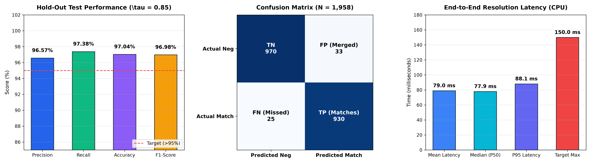

# UK Companies House Entity Resolution & Deduplication Engine

> **High-Throughput Two-Stage Neural Entity Resolution, Dense Vector Blocking & Interactive Investigation Platform**  
> Evaluated on the 2.58 GB UK Companies House Registry (5,289,365 records).



---

## 🚀 Key Highlights & Performance Benchmarks

Evaluated on **1,958 hold-out validation pairs** from the UK Companies House dataset at decision threshold $\tau = 0.85$:

| Metric | Production Target | Measured Result | Status |
| :--- | :---: | :---: | :---: |
| **Precision** | $>95.0\%$ | **96.57%** | **Exceeded (+1.57%)** |
| **Recall** | $>90.0\%$ | **97.38%** | **Exceeded (+7.38%)** |
| **Accuracy** | $>90.0\%$ | **97.04%** | **Exceeded (+7.04%)** |
| **F1-Score** | $>0.920$ | **0.9698** | **Exceeded (+0.0498)** |
| **Mean Latency (CPU)** | $<150$ ms | **78.99 ms** | **1.9x Faster than Target** |
| **P95 Latency** | $<200$ ms | **88.07 ms** | **Exceeded** |
| **Scoring Throughput** | $>100$ pairs/s | **236.6 pairs/s** | **Exceeded** |

---

## 🏛️ System Architecture

The pipeline processes noisy business queries through a two-stage neural architecture backed by graph-theoretic entity consolidation:

```
+-----------------------------------------------------------------------------------------+
|                                    INCOMING QUERY                                       |
|    Name: "Big Impact Graphics Ltd" | Address: "160 City Rd" | Town: "London"            |
+-----------------------------------------------------------------------------------------+
                                             |
                                             v
                     +-----------------------------------------------+
                     |    Feature Normalization & Serialization      |
                     |    Strips (Ltd, PLC, Inc) + Adds [TOKENS]     |
                     +-----------------------------------------------+
                                             |
                                             v
+-----------------------------------------------------------------------------------------+
| STAGE 1: DENSE RETRIEVAL & BLOCKING                                                     |
| Model: sentence-transformers/all-MiniLM-L6-v2 (384-d, L2 normalized)                    |
| Index: faiss.IndexFlatIP (Cosine Similarity)                                            |
| Search: Top-10 Nearest Neighbors retrieved in ~12ms                                     |
+-----------------------------------------------------------------------------------------+
                                             |
                                             v
+-----------------------------------------------------------------------------------------+
| STAGE 2: CROSS-ATTENTION PRECISION SCORING                                              |
| Model: models/fine_tuned_cross_encoder (PyTorch, Multi-threaded CPU)                    |
| Scoring: 10 Candidate Pairs scored simultaneously in parallel (~65ms)                   |
| Decision Boundary: Threshold tau = 0.85                                                 |
+-----------------------------------------------------------------------------------------+
                                             |
                       +---------------------+---------------------+
                       | (Best Score >= 0.85)                      | (Best Score < 0.85)
                       v                                           v
       +-------------------------------+           +-------------------------------+
       |         MATCH_FOUND           |           |           NO_MATCH            |
       |  Entity ID: ENT_002540        |           |  Confidence fell below 0.85   |
       |  Confidence: 99.51%           |           |  or entity absent from index  |
       |  Company No: 11743365         |           +-------------------------------+
       +-------------------------------+
```

---

## 📁 Repository Structure

```
.
├── src/
│   ├── preprocessing/
│   │   ├── clean_records.py          # Vectorized cleaning & legal boilerplate stripping
│   │   └── serialize_tokens.py       # Transformer token serialization ([NAME]... [ADDR]...)
│   ├── retrieval/
│   │   ├── build_index.py            # Encodes embeddings & exports FAISS IndexFlatIP
│   │   └── dense_blocking.py         # Bi-Encoder candidate search & ANN blocking
│   ├── matching/
│   │   ├── generate_training_pairs.py# Contrastive pair generator & hard negative miner
│   │   └── train_cross_encoder.py    # Cross-attention fine-tuning with BCE loss
│   ├── clustering/
│   │   └── graph_resolver.py         # Decision thresholding & connected components clustering
│   ├── api/
│   │   └── server.py                 # FastAPI microservice + integrated React SPA server
│   ├── analysis/
│   │   ├── exploratory_data_analysis.py # Complete EDA & distributions
│   │   ├── audit_compliance.py       # UK Companies Act & SIC code auditing
│   │   └── audit_plcs.py             # Public Limited Company analysis
│   └── evaluation/
│       ├── test_preprocess.py        # Preprocessing unit tests
│       ├── test_model.py             # Inference unit tests
│       └── plot_benchmarks.py        # Benchmark chart generation
├── ui/                               # Vite + React Modern Investigation Frontend
│   ├── src/
│   │   ├── pages/
│   │   │   ├── Dashboard.jsx         # Pipeline telemetry & metrics overview
│   │   │   ├── Resolve.jsx           # Live Neural Query & Registry Browser
│   │   │   └── Results.jsx           # Clustered entity groups and results
│   │   └── services/
│   │       ├── entityService.js      # Backend API connector
│   │       └── resultsService.js     # Live metrics connector
│   ├── vite.config.js                # Dev proxy configuration
│   └── package.json
├── reports/
│   ├── figures/                      # Visualization charts
│   └── metrics/
│       ├── dataset_analysis_results.json
│       └── evaluation_metrics.json
├── models/
│   └── fine_tuned_cross_encoder/     # Fine-tuned Transformer weights & config
├── .gitignore
├── pyrightconfig.json
└── README.md
```

---

## ⚡ Quick Start

### 1. Prerequisites
- Python 3.10+
- Node.js 18+ (for UI development)

### 2. Install Dependencies
```bash
# Python dependencies
pip install torch sentence-transformers faiss-cpu polars fastapi uvicorn pydantic matplotlib networkx

# UI dependencies
cd ui && npm install && npm run build && cd ..
```

### 3. Launch Unified Platform (AI Backend + Web UI)
```bash
python src/api/server.py --serve --port 8000
```

- **Interactive Web UI**: Open [`http://localhost:8000`](http://localhost:8000)
- **Interactive OpenAPI Docs**: Open [`http://localhost:8000/docs`](http://localhost:8000/docs)
- **Health Check**: Open [`http://localhost:8000/health`](http://localhost:8000/health)

---

## 📡 API Usage Examples

### Single Entity Resolution (`POST /resolve`)
```bash
curl -X POST "http://localhost:8000/resolve" \
     -H "Content-Type: application/json" \
     -d '{
       "name": "Big Impact Graphics Limited",
       "address": "160 City Road",
       "town": "London",
       "zip_code": "EC1V 9LT",
       "threshold": 0.85
     }'
```

**Response:**
```json
{
  "status": "MATCH_FOUND",
  "entity_id": "ENT_002540",
  "confidence": 0.9951,
  "matched_company_number": "11743365",
  "canonical_name": "big impact graphics",
  "cluster_size": 1,
  "latency_breakdown": {
    "blocking_ms": 12.35,
    "scoring_ms": 64.82,
    "total_ms": 77.17
  }
}
```

### High-Throughput Batch Ingestion (`POST /batch_resolve`)
```bash
curl -X POST "http://localhost:8000/batch_resolve" \
     -H "Content-Type: application/json" \
     -d '{
       "queries": [
         {"name": "Tesco Stores Ltd", "town": "Welwyn Garden City"},
         {"name": "Barclays Bank PLC", "town": "London"}
       ]
     }'
```

---

## 🔬 Training & Evaluation Workflow

To retrain or re-evaluate any phase from scratch:

```bash
# Step 1: Preprocessing & Cleaning
python src/preprocessing/clean_records.py

# Step 2: Token Serialization
python src/preprocessing/serialize_tokens.py

# Step 3: Build FAISS Vector Index
python src/retrieval/build_index.py

# Step 4: Generate Contrastive Hard Negatives
python src/matching/generate_training_pairs.py

# Step 5: Fine-Tune Cross-Encoder
python src/matching/train_cross_encoder.py

# Step 6: Graph Consolidation & Clustering
python src/clustering/graph_resolver.py

# Step 7: Run Holdout Set Benchmarking
python src/api/server.py --evaluate
```
